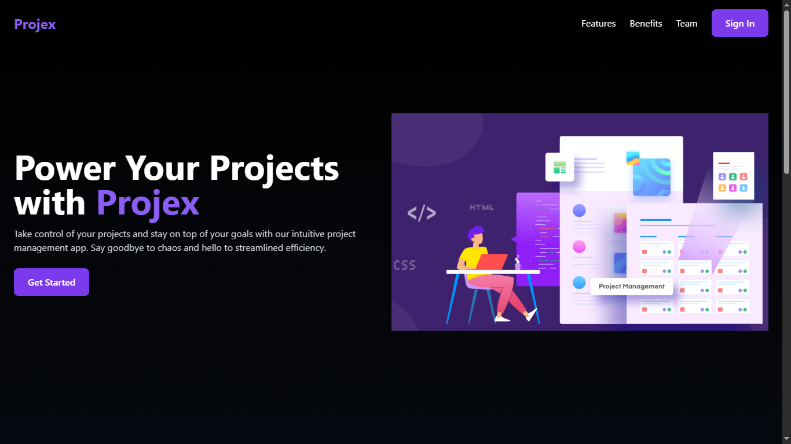
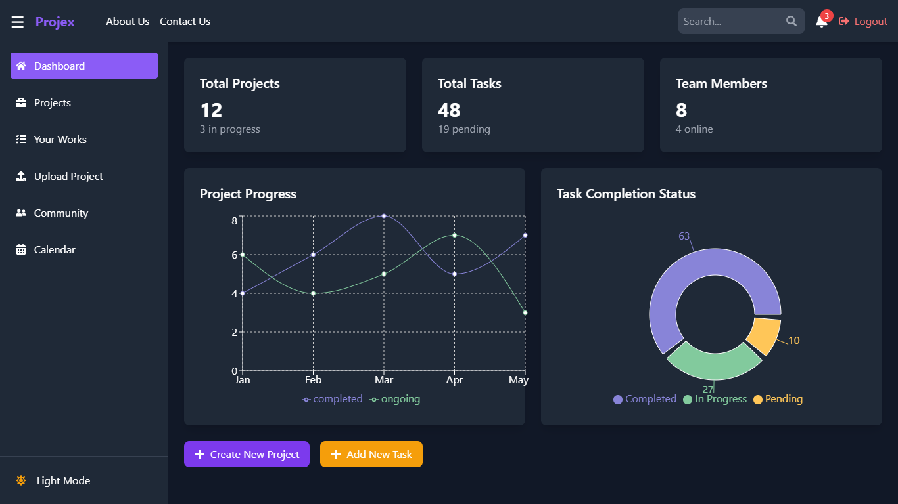
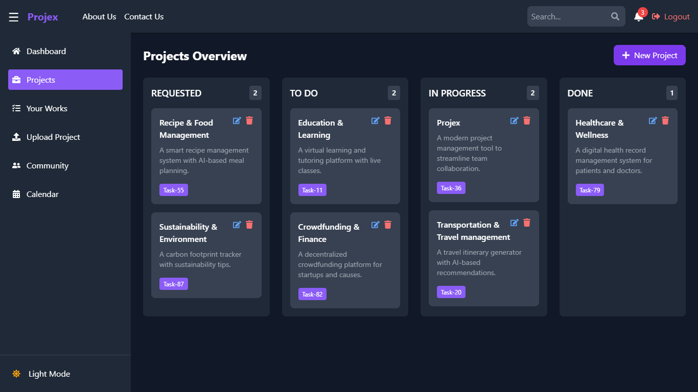
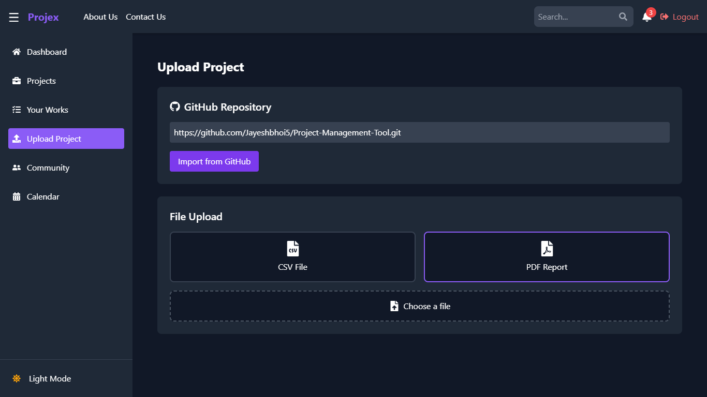

# 🚀 Projex - Project Management Tool

Projex is a modern **project management tool** designed to help teams **organize tasks, schedule deadlines, collaborate efficiently, and track progress** with an intuitive dashboard. This project is built with the **MERN stack**, but currently, only the **frontend** is implemented.

## 🌟 Features

✅ **Dashboard with Charts & Graphs** – Visualize project progress in an interactive way.  
✅ **Project Management** – Track tasks in different stages: **Requested, To-Do, In Progress, Done**.  
✅ **Upload Project Section** – Seamlessly upload project files and GitHub repositories.  
✅ **Calendar Integration** – Schedule deadlines, team calls, and meetings.  
✅ **Team Collaboration** – Engage with your team in a built-in **Community Section**.  
✅ **Light & Dark Mode** – Customize your workspace with theme preferences.  

---

## 🎨 UI Overview

### 📤 Homepage Section (Includes sign up & sign in with Oauth)

### 📊 Dashboard (Includes Charts & Graphs)

### 📂 Project Section (Requested, To-Do, In Progress, Done)

### 📅 Upload Project Section (CSV file,Pdf Report,Import Git hub link for Project Submission)

## 🛠️ Tech Stack

- **Frontend**: React (Vite), Tailwind CSS  
- **State Management**: React Hooks  
- **Routing**: React Router  
- **Icons & UI Components**: React Icons   

---

## 🚀 Getting Started

### 🔧 Prerequisites

Make sure you have **npm** , **react** installed.

